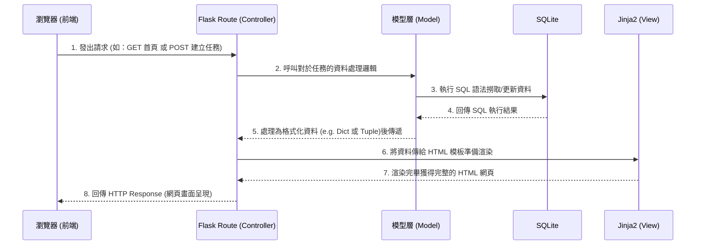

# 任務管理系統 - 系統架構文件 (ARCHITECTURE)

## 1. 技術架構說明
本專案採用經典的伺服器端渲染 (Server-Side Rendering, SSR) 架構，也就是前端與後端並沒有分離，所有頁面皆由後端組合資料並渲染為 HTML 之後返回給瀏覽器。

- **選用技術與原因**：
  - **後端 (Python + Flask)**：Flask 是一個輕量、靈活的框架，非常適合快速構建中小型應用（如本任務管理系統）。它的學習曲線平緩，能讓開發者專注於核心邏輯。
  - **模板引擎 (Jinja2)**：作為 Flask 內建的模板引擎，它能無縫接軌。它負責動態將後端拋出的任務資料（變數、迴圈）組合成最終的 HTML 介面。
  - **資料庫 (SQLite)**：作為一個輕量的本地端關聯式資料庫，無需設置複雜的資料庫伺服器，非常符合追求簡潔與快速啟動的個人或小型系統。

- **Flask MVC 模式說明**：
  雖然 Flask 預設並不強制規範 MVC（Model-View-Controller），但為了好維護，我們會依循這個概念來組織程式碼：
  - **Model (模型)**：負責與 SQLite 互動，實作任務資料的新增、修改、刪除與查詢邏輯。
  - **View (視圖)**：Jinja2 模板（位於 `templates/`），決定畫面的 HTML 結構與外觀呈現。
  - **Controller (控制器)**：Flask 的 Route (路由邏輯)，負責接收來自使用者的 Request、調用 Model 取得資料，最後把資料傳給 View 來產生畫面。

## 2. 專案資料夾結構

本專案依照模組化的方式來安排目錄結構，方便日後擴充：

```text
web_app_development/
├── app/
│   ├── __init__.py        ← 應用程式實例初始化區
│   ├── models/            ← Model 層：資料庫存取層
│   │   └── task.py        ← 任務模型的 CRUD 邏輯
│   ├── routes/            ← Controller 層：Flask 路由
│   │   └── task_routes.py ← 負責處理清單、新增、更新、刪除等路由請求
│   ├── templates/         ← View 層：Jinja2 HTML 模板
│   │   ├── base.html      ← 頁面共用架構（導覽列、載入 CSS/JS）
│   │   ├── index.html     ← 首頁（任務清單總覽與任務狀態切換）
│   │   └── form.html      ← 任務新增與編輯共用的表單視圖
│   └── static/            ← 靜態資源 (樣式表、腳本、圖片等)
│       ├── style.css      ← 全站共用的 CSS
│       └── main.js        ← 前端簡單互動效果腳本
├── instance/
│   └── database.db        ← SQLite 資料庫實體檔案 (自動生成)
├── docs/                  ← 文件區
│   ├── PRD.md             ← 產品需求文件
│   └── ARCHITECTURE.md    ← 系統架構說明 (本文件)
├── app.py                 ← 程式執行入口
└── requirements.txt       ← Python 第三方套件清單
```

## 3. 元件關係圖

以下利用 Mermaid 將資料流視覺化：



## 4. 關鍵設計決策

1. **無前後端分離架構**：在此 MVP 階段下，若採用 React 搭配 Flask API，除了會增加複雜度外，連開發耗時也會拉長。所以維持透過 Jinja2 在後端渲染，讓一筆表單送出後，能迅速直接重新載入整個列表，提升初期開發效率。
2. **根據職責劃分資料夾**：沒有將所有邏輯（資料庫與路由）塞入單一的 `app.py` 中，而是將 `Model` 與 `Controller(Route)` 分開放進獨立檔案內。這樣的設計讓資料夾目的更明顯，降低日後維護時「看程式碼像在撈大海」的風險。
3. **簡易的提醒機制實作**：PRD 要求「提醒待完成任務」。我們不刻意引入複雜的異步訊息框架（如 Celery + Redis）來發送系統通知，而是在使用者造訪「首頁列表」時，透過讀取 Model 中計算出的任務剩餘時間（或到期日），由 Jinja2 模板動態加上「紅點通知」或「醒目高亮」視覺效果。這樣的做法能在無需複雜後端基建的狀況下，直接達成 MVP 提醒需求。
4. **共享表單視圖設計**：新增與編輯在資料結構上大多相同（都有標題、敘述等等），因此將採用同一個 `form.html`。在 Route 層區分並帶入不同的變數（有無現成數據），有助於減少維護多份相似 HTML 的風險。
