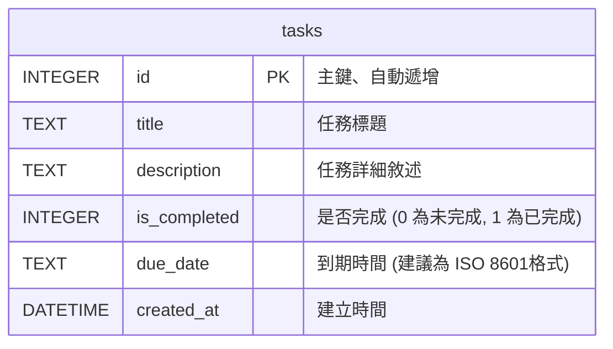

# 任務管理系統 - 資料庫設計文件 (DB DESIGN)

本文件依據 PRD 與架構文件，定義專案中使用的 SQLite 資料庫表結構，以滿足核心的 CRUD 需求與狀態管理。

## 1. ER 圖（實體關係圖）

由於目前 MVP 的設計僅限定單一的「任務」實體（尚未加入使用者、標籤等複雜功能），所以目前的資料結構為一張獨立的表。

## 2. 資料表詳細說明

### `tasks` (任務表)
負責儲存系統中所有的待辦任務紀錄。

| 欄位名稱 | 型別 | 必填 | 說明 |
| --- | --- | --- | --- |
| `id` | INTEGER | 是 | Primary Key，系統自動遞增流水號 |
| `title` | TEXT | 是 | 任務標題，供前端列表主要顯示用 |
| `description` | TEXT | 否 | 任務的長篇詳細描述 |
| `is_completed`| INTEGER | 是 | 記錄狀態：`0` 代表未完成, `1` 代表已完成。預設為 `0` |
| `due_date` | TEXT | 否 | 任務到期時間字串，用以作前端的即將到期判斷與紅點提醒 |
| `created_at` | DATETIME| 否 | 紀錄入表的時間，資料庫預設帶入 `CURRENT_TIMESTAMP` |

## 3. SQL 建表語法
完整的 `CREATE TABLE` 語法已匯出至 `database/schema.sql` 檔案中。

## 4. Python Model 程式碼
依據架構文件所述：「無複雜 ORM，透過輕量化方式操作 SQLite」。我們採用原生 `sqlite3` 庫實作了 CRUD 操作邏輯，該 Python 腳本放置於 `app/models/task.py` 中。
