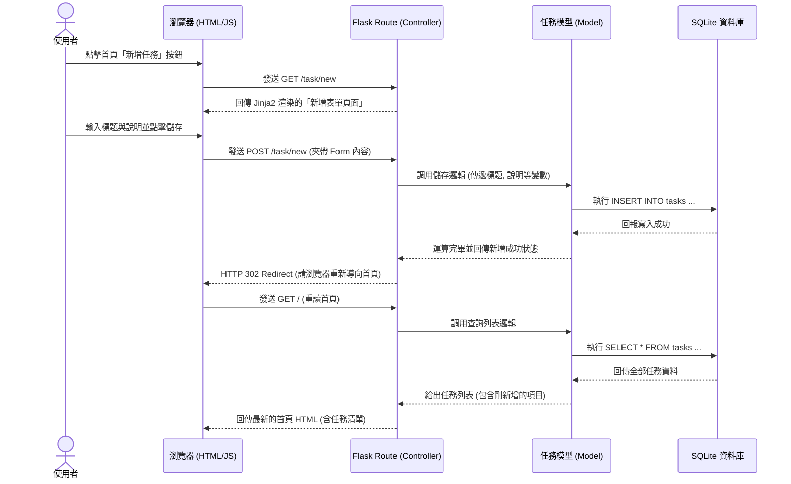

# 任務管理系統 - 流程圖文件 (FLOWCHART)

本文件綜合了 PRD 的功能需求以及系統架構設計，透過視覺化的流程圖與序列圖，說明「任務管理系統」中使用者的操作路徑與內部資料流。

## 1. 使用者流程圖 (User Flow)

此圖展示了使用者進入系統後，可以進行的各項主要操作以及相對應的畫面跳轉。我們採用最直覺的清單管理介面。

```mermaid
flowchart LR
    Start([使用者進入網站]) --> Index[首頁 - 任務列表]
    
    Index --> Action{想要執行什麼操作？}
    
    Action -->|切換狀態| Toggle[點擊「標記完成/未完成」按鈕]
    Toggle --> Index
    
    Action -->|刪除| Delete[點擊「刪除」按鈕]
    Delete -->|依系統確認| DoneDelete[任務被移除]
    DoneDelete --> Index

    Action -->|新增任務| ClickAdd[點擊「新增任務」]
    ClickAdd --> FormPage[表單頁面 (新增)]
    FormPage -->|填寫完畢並送出| SubmitAdd[系統存檔]
    SubmitAdd --> Index
    FormPage -->|點擊取消| Index
    
    Action -->|編輯任務| ClickEdit[點擊「編輯任務」]
    ClickEdit --> EditFormPage[表單頁面 (編輯)]
    EditFormPage -->|修改完畢並送出| SubmitEdit[系統更新存檔]
    SubmitEdit --> Index
    EditFormPage -->|點擊取消| Index
```

## 2. 系統序列圖 (Sequence Diagram)

在這裡，我們以「新增任務」為例，展示完整的伺服器端渲染 (SSR) 回應週期，涵蓋從畫面的 GET 請求，到資料 POST 回後端及資料庫的行為。



## 3. 功能清單對照表

以 RESTful 及 SSR 常見慣例所設計的基礎路由與操作對照，這也是未來實作 API 與頁面跳轉的參照依據：

| 功能描述 | URL 路徑 | HTTP 方法 | 用途說明 |
| --- | --- | --- | --- |
| 瀏覽任務列表 | `/` | GET | 渲染首頁，呈現包含狀態與紅點提醒的任務清單 |
| 新增任務 (呈現表單) | `/task/new` | GET | 回傳用來填寫新任務內容的表單 HTML |
| 新增任務 (送出資料) | `/task/new` | POST | 接收表單傳來的資料寫入資料庫，並重導向回首頁 (`/`) |
| 編輯任務 (呈現表單) | `/task/<id>/edit` | GET | 讀取指定任務的現有資料，在前台表單中預填展示 |
| 編輯任務 (送出資料) | `/task/<id>/edit` | POST | 接收更新後的內容改寫資料庫，並重導向回首頁 (`/`) |
| 刪除任務 | `/task/<id>/delete` | POST | 接收刪除請求以從資料庫移除指定任務 |
| 狀態切換 (標記完成) | `/task/<id>/toggle` | POST | 切換特定任務的「完成/未完成」狀態 |
